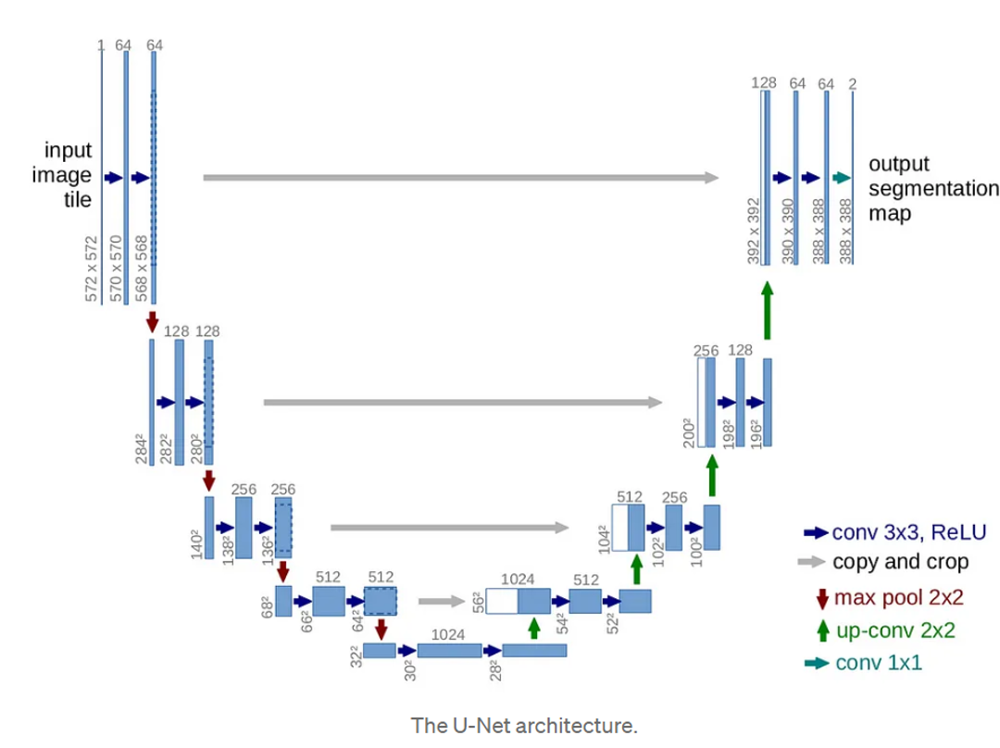
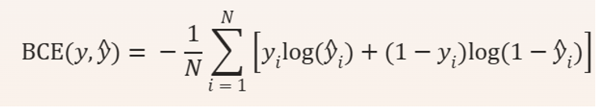

# Pattern Analysis
----------------Detecting the cancer position with 2D UNet ----------------
UNet is a combination of Encoder and Decoder to solve multiple image problems such as object detection (this project) and image generation.
The structure is as below.

 (Aramendia. I., 2024)
The first half part is the AutoEncoder to extract the latent space from the original input images with 3 layers of double convolutional networks followed by max pooling to down sample the image size. At the bottle neck layer, the network retains the most extracted features of the original input to generate the images based on. It then utilizes up sampling by reversing the operations done in the first half part. During that, the images processed by only part of the down sampling networks are combined with the input so that the information from the original images are retained as much as possible during the feature extraction.  
---------------Code structure------------------------------------------------------
I first set up the UNet network and activated the train mode. During the training process the model goes through these processes.
1.	Iterate over the same train and validation dataset 40 times.
2.	For each iteration, iterate over train dataset batches divided by DataLoader to update the model parameters frequently.
3.	Then, switch to evaluation mode and record the loss function for validation dataset.
4.	After all epochs are done, use test dataset to calculate final test loss value and Dice Similarity Coefficient.
----------------Optimization--------------------------------------------------------
The BCE loss function is used to calculate the cost of each iteration, which is calculated by this.
  
  y: true label y_hat: predicted
In order to update the parameters, Stochastic Gradient Descent was used.
---------------How to use the code----------------------------------------------
1.	Run train.py
2.	Load test dataset form train.py or any other dataset from the same image group and feed it to predict() in predict.py.
-------------Reference-----------------------------------------------------
Aramendia, I. (2024). The U-Net: A Complete Guide. https://medium.com/@alejandro.itoaramendia/decoding-the-u-net-a-complete-guide-810b1c6d56d8
